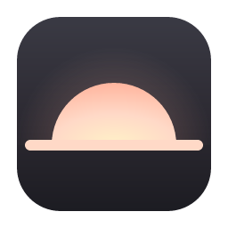

<p align="center">
  
</p>

<h1 align="center">sunrise</h1>

<p align="center">
  🌅 Un planner para tu día a día
</p>

---

Planificas el día, cronometras lo que haces, y al final de la jornada la cierras. **Sin cuentas, sin servidor, sin suscripción y sin IA**. Tu uso vive en un archivo SQLite dentro de tu máquina.

## 👋 Un aviso honesto

Sunrise es una herramienta personal, publicada porque _why not_. Pasé por organizarme en planners de papel, en Notion, en Toggl, en Google Calendar, y finalmente en Sunsama, donde encontré un hogar, aunque estaba medio caro. Armé Sunrise para que funcione en mi día a día de trabajo, y le iré subiendo updates en base a lo que necesite. Si te sirve, de nada <3, si tienes cambios, te agradezco un PR, si te gusta, deja una estrellita ✨


## ✨ Qué hace

- 🗓️ **Semana y día:** Tablero de siete columnas con arrastrar y soltar, tiempo planificado contra tiempo real, y un semáforo de capacidad para cuando el día ya no cabe.
- ⏱️ **Taxímetro:** Cronómetro por tarea con una ventana flotante que se queda encima de todo, y una campana cuando pasas el estimado.
- 🎯 **Focus:** Una tarea a la vez, en la cola que decidiste, sin el resto de la app a la vista.
- 📅 **Calendario por ICS:** Tus reuniones entran como tareas y se sincronizan solas.
- 📊 **Weekly Review y cierre del día:** Horas por canal, avance de los objetivos, y una bitácora que se arma con lo que hiciste.
- 💾 **Respaldos:** Un `.zip` con todo y un `manifest.yml` que dice de qué versión salió, a la hora que elijas, en la carpeta que elijas.

## 📦 Instalar

Descarga el `.dmg` de la [última versión](https://github.com/devswert/sunrise/releases/latest), ábrelo y arrastra sunrise a Aplicaciones. Necesitas macOS 11 o más nuevo, en un Mac con Apple Silicon.

> ⚠️ **La primera vez** macOS va a decir que no puede verificar al desarrollador. Es porque el paquete no está firmado con una cuenta de Apple Developer (no quería pagar 99 USD).

De ahí en adelante la app se actualiza sola desde `Configs → General → Actualizaciones`. Esas descargas no vuelven a pasar por el aviso.

## 🛠️ Desarrollo

Necesitas [Rust](https://rustup.rs), Node 22 y `pnpm`.

```bash
pnpm install
pnpm tauri dev    # la app y su ventana flotante
```

```bash
pnpm test         # Vitest + RTL
pnpm test:rust    # cargo test, con SQLite en memoria
pnpm test:all     # ambos
pnpm dmg          # build de release: .app y .dmg
```

**Dev y la app instalada no comparten datos**: la base de desarrollo es `sunrise-dev.sqlite` y la de verdad es `sunrise.sqlite`, las dos en `~/Library/Application Support/app.sunrise.desktop`. Las dos pueden estar abiertas a la vez; el sidebar muestra un distintivo `dev` para que se sepa cuál es cuál.

Para trabajar contra datos reales sin tocarlos, respalda desde la app instalada e importa ese `.zip` en dev.

El front también corre sin Tauri (`pnpm dev`), contra una base falsa en memoria.
Es lo que hace posible ver la app en el navegador y correr los tests en jsdom.

## 🧩 Cómo está armado

Tauri v2 (Rust) + React 18 + TypeScript + Vite, y SQLite vía `rusqlite`.

Dos reglas cargan con casi todo el diseño:

- 🦀 **Todo el SQL vive en `src-tauri/src/repo.rs`**, en funciones puras sobre una `&Connection`. No conocen Tauri, y por eso se prueban de verdad contra una base en memoria. Los comandos son envoltorios delgados.
- 🔌 **Todo acceso a datos pasa por `src/lib/ipc.ts`**, que tiene un gemelo en `src/lib/mockDb.ts`. Ningún componente habla con Tauri por su cuenta.

La documentación está toda en el repo, y es el punto de partida para cambiar algo:

| | Qué |
|---|---|
| 📘 [docs/SPECS.md](docs/SPECS.md) | todo lo que existe hoy y cómo funciona, con las invariantes y la deuda conocida |
| 🗺️ [docs/ROADMAP.md](docs/ROADMAP.md) | qué falta, en orden |
| 📐 [CLAUDE.md](CLAUDE.md) | las reglas de trabajo |

Cada decisión que costó algo está escrita **con el por qué**, incluidas las que se tomaron después de que la alternativa obvia fallara. Ahí está el valor, más que en el diff.
